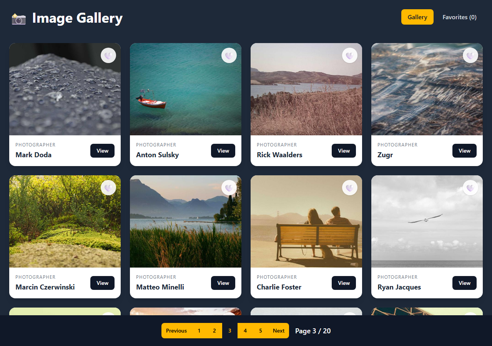
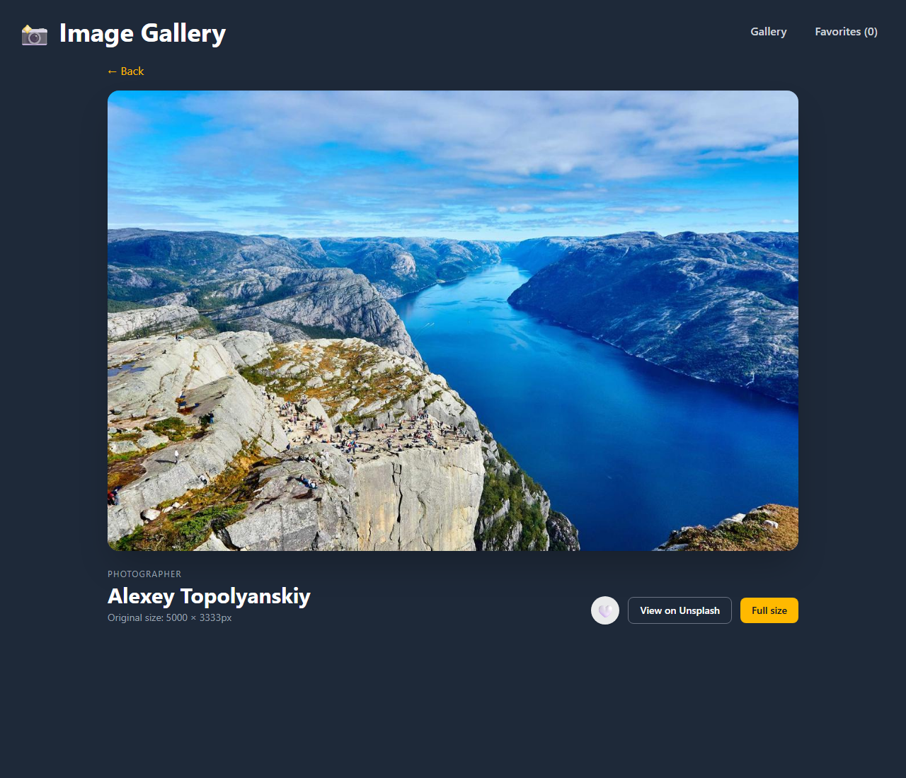

# 📸 Image Gallery

A photo gallery built with React that pulls photos from the [Lorem Picsum](https://picsum.photos/) API. You can page through almost 1,000 photos, open any photo for a closer look, and save your favorites.

**Live demo:** _add your link here after deploying_




## Features

- **Pagination.** A reusable `Pagination` component shows a sliding window of page numbers. The current page is kept in the URL (`/?page=4`), so refresh and the browser Back button work as expected.
- **Photo detail page.** `/photo/:id` shows a larger version of the photo, the photographer, the original size, and links to Unsplash and the full-size file.
- **Favorites.** Heart any photo to save it. Favorites are shared across the app with the **Context API** and saved in `localStorage`.
- **Loading and error states.** Skeleton cards appear while photos load. If a request fails you get an error screen with a "Try again" button.
- **Responsive.** The grid goes from 1 to 4 columns depending on screen size.

## Performance

- The grid loads resized 600×400 thumbnails instead of the original photos, which are often 5000px wide.
- Images use `loading="lazy"`, so off-screen photos aren't downloaded until you scroll to them.
- `Imagecard` is wrapped in `React.memo`.
- The detail, favorites and 404 pages are loaded with `React.lazy` and split into their own chunks.
- An `AbortController` cancels the old request when you switch pages quickly, so a slow response can't overwrite a newer one.

## Tech stack

- React 19 (hooks, Context API, `memo`, `lazy`/`Suspense`)
- React Router 7
- Axios
- Tailwind CSS 4
- Vite

## Project structure

```
src/
├── components/     Imagecard, Pagination, FavoriteButton, SkeletonCard, ErrorMessage
├── context/        FavoritesProvider and the useFavorites hook
├── pages/          Gallery, PhotoDetail, Favorites, NotFound
├── App.jsx         header + routes
└── main.jsx
```

## Running locally

```bash
git clone https://github.com/Ibrahim-techie/gallery-project.git
cd gallery-project
npm install
npm run dev
```

Then open http://localhost:5173.

## Deploying

`npm run build` creates a static site in `dist/`. Because this is a single-page app, the host has to send every URL to `index.html`. Both common hosts are already set up for that:

- **Netlify:** `public/_redirects`
- **Vercel:** `vercel.json`

## What I'd add next

- Search or filter by photographer
- Infinite scroll as an alternative to pagination
- Unit tests with Vitest and React Testing Library
